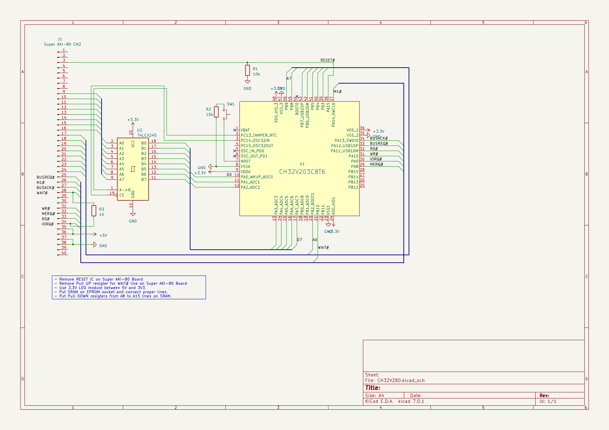

# CH32V203 で AKI-80 を制御するソフトウェア(サンプル)

これは Super AKI-80 を、CH32V203 から制御するためのプログラム例です。

現時点でUNIMON for SAKI80 (https://github.com/yyhayami/saki80mon041) が起動するコードになっています。

参考回路図

詳しくは以下の記事を参照してください。

- https://shippoiincho.github.io/posts/43/
- https://shippoiincho.github.io/posts/44/
- https://shippoiincho.github.io/posts/45/